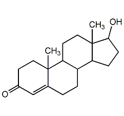
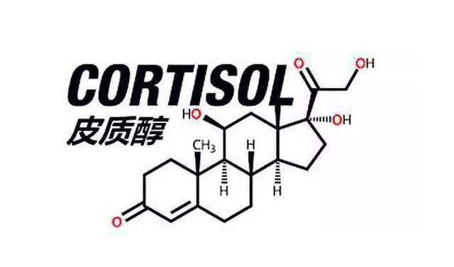

## 1. 睾酮（Testosterone）

人体最主要的雄性激素。男性主要在**睾丸**合成，少量在肾上腺。女性：主要在**卵巢**和肾上腺合成。具有维持肌肉强度及质量、维持骨质密度及强度、提神及提升体能等作用。

正常区间：（注意单位，化验单是 **nmol/L**须换算）

- 青年 / 成年男性：**250 ~ 1100 ng/dL**

- 成年女性：**15 ~ 70 ng/dL**

**低睾酮**：累、胖、虚、没欲望、情绪差。**高睾酮**：躁、油、痘、毛多、月经乱（女）。

睾酮会影响许多身体系统和功能：血生成，体内钙平衡，骨矿化作用，脂代谢，糖代谢和前列腺增长。

**对于健身的男性而言，通常目标为“提高睾酮”水平，睾酮高一点，你会明显感觉：**肌肉长得更快，力量涨得更明显，精力足、欲望强、情绪不低落。

最影响睾酮的 6 大因素：

1. **睡眠（影响最大）**

- 睾酮主要在**夜间深睡眠**分泌
- 每天＜6 小时：睾酮明显下降
- 熬夜、作息乱＝直接 “砍” 睾酮

2. **体脂率（尤其肚子胖）**

- 脂肪里有**芳香化酶**，会把睾酮变成雌激素
- **肚子越大 → 睾酮越低**
- 体脂太高、太低都不好

3. **饮食（吃不对直接垮）**

- 缺**锌、镁、维生素 D** → 睾酮低
- 长期**节食、热量太低** → 身体保命，直接停睾酮
- 吃太少脂肪 → 激素原料不足

4. **训练方式**

- 大重量复合动作（深蹲、硬拉、卧推）→ **促睾酮**
- 过度训练、天天练到崩 → 皮质醇升高，**压睾酮**
- 只练手臂不练腿 → 刺激太小

5. **压力与情绪**

- 压力大 → 皮质醇高 → 睾酮被压制
- 长期焦虑、烦躁、熬夜 → 内分泌紊乱

6. **年龄**

- 男性 30 岁后每年自然下降 1%～2%
- 40 岁后下降更明显
- 但**生活习惯差的人掉得更快**

总的来说，通过合理饮食、规律运动、充足睡眠、控制体重、减少压力和酒精摄入等方法，我们可以有效提高睾酮水平，从而维持良好的健康状

## 2. 皮质醇

皮质醇是“压力激素”，无论是心理压力还是生理压力，都会诱导肾上腺皮质分泌皮质醇，促进肝糖原分解和糖异生，升高血糖，抑制肌肉和脂肪组织对葡萄糖的摄取，优先保证大脑和重要器官的能量供应；并抑制非必要生理功能（如免疫、消化）。

皮质醇是身体对压力做出反应的一部分，有助于提高能量水平和警觉性，帮助我们应对危险或挑战。健身显然是一种“生理压力”，尤其是持续时间较长（如超过 1 小时）的高强度训练，会导致皮质醇升高。

皮质醇就是**压力激素**，它和睾酮是**此消彼长**的关系。**皮质醇的副作用是：会促进蛋白质分解（尤其是肌肉蛋白），抑制蛋白质合成，可能导致肌肉流失，与增肌目标相悖**。如果皮质醇长期过高，则会带来更大的问题：骨骼密度下降（长期皮质醇升高可抑制成骨细胞活性）、导致胰岛素抵抗并增加 2 型糖尿病风险、促进腹部脂肪堆积、引发向心性肥胖、高血脂等代谢综合征等一系列问题。（这也是为什么我们倡导心情保持愉悦的原因之一）

当我们健身时，怎么合理控制皮质醇呢？

**1.控制健身时长。**每次不超过 45-60 分钟，避免持续冲击身体应激系统。力量训练后需重点补充碳水和蛋白质，避免皮质醇分解肌肉。

**2.合理安排休息与恢复。**力量训练可采用 “分化训练”，大肌群（如胸、背、腿）训练后至少休息 48 小时，小肌群（如手臂、肩）休息 24-36 小时。避免持续疲劳和过度训练带来的皮质醇失衡。

**3.充足的睡眠。**睡眠不足会导致皮质醇升高；建议每天保证 7-9 小时睡眠。高强度的健身后，需要额外的睡眠时长，促进睾酮（合成代谢激素）分泌，对抗皮质醇的分解作用。

**4.饮食调节激素平衡**。在健身前，摄入 30-50g 复合碳水（如 1 根香蕉 + 1 片全麦面包），稳定血糖防止皮质醇飙升。在健身后，补充 20-30g 蛋白质 + 30-40g 快速碳水（如 200ml 牛奶 + 1 勺蛋白粉 + 半根红薯），阻断皮质醇对肌肉的分解。同时，对于全天饮食而言，计算每日蛋白质摄入 1.2-2.0 克*自身体重KG，避免皮质醇分解肌肉蛋白。

如果上了一天班身体非常疲惫，那就好好休息一天！如果前一天熬夜了、睡眠不好，那就好好休息一天！如果心理压力很大、心率很高，那就好好休息一天！休息充足，才是健身的核心！

## 3. 胰岛素与血糖

血糖和胰岛素之间的关系是人体新陈代谢中最核心的机制之一。它们就像是身体能量管理的“黄金搭档”，一旦这个系统的平衡被打破，就会引发肥胖、胰岛素抵抗甚至糖尿病等一系列健康问题。

血糖（血液中的葡萄糖）是人体细胞的主要能量来源，而胰岛素是由胰腺分泌的一种荷尔蒙。它们的关系可以总结为以下三个核心机制：

**“钥匙”与“锁”的开门效应**

当我们进食碳水化合物后，食物会被分解为葡萄糖进入血液，导致血糖升高。此时，胰腺会分泌胰岛素。胰岛素就像是一把“钥匙”，它与细胞表面的受体（锁）结合，打开细胞通道，让血液中的葡萄糖进入肌肉、脂肪和肝脏细胞中转化为能量。在这个过程中，血液中的葡萄糖浓度随之下降，恢复到正常水平。

**能量的储存机制**

当摄入的血糖多于身体当前的消耗需求时，胰岛素会指挥肝脏和肌肉将多余的葡萄糖转化为**糖原**储存起来。如果糖原的“仓库”也满了，胰岛素就会极其高效地将剩余的葡萄糖转化为**脂肪**囤积在体内。因此，胰岛素也被称为“合成代谢荷尔蒙”或“储脂荷尔蒙”。

**胰岛素抵抗（Insulin Resistance）**

如果长期进食大量高糖、高精制碳水食物，导致血糖频繁飙升，胰腺就不得不持续分泌大量胰岛素。久而久之，细胞会对胰岛素这把“钥匙”变得迟钝，不愿意开门。这就是“胰岛素抵抗”。此时，身体为了把血糖降下来，只能分泌更多的胰岛素（高胰岛素血症），最终导致恶性循环，引发2型糖尿病和顽固性肥胖。

因此，**保持胰岛素的敏感性和血糖的平稳是核心目标**，日常生活中可以采取以下策略：

- **控制碳水化合物的质量（低GI饮食）：** 减少精白米面和添加糖的摄入，多吃全谷物、蔬菜等富含膳食纤维的食物。在日常饮品选择上，可以利用黄豆和花生等坚果自制无糖豆浆，这种饮品不仅富含优质植物蛋白和健康脂肪，升糖指数（[GI](/health/gi/)）也非常低，能带来极强的饱腹感并有效平稳餐后血糖。

- **进食顺序有讲究：** 按照“蔬菜/膳食纤维、蛋白质/脂肪 、碳水化合物”的顺序进餐，可以利用纤维和蛋白质在胃部形成缓冲，显著降低餐后血糖的峰值。

- **规律作息与压力管理：** 熬夜和长期精神压力会导致体内皮质醇（压力荷尔蒙）水平升高。皮质醇会拮抗胰岛素的作用，直接促使肝脏释放葡萄糖，导致空腹血糖升高。

  

对于有运动和健身习惯的人群来说，胰岛素不仅仅是“储脂荷尔蒙”，更是促进肌肉合成的“关键工具”。如何巧妙利用它是一门学问：

**1. 把握训练后的“合成窗口期”**

在力量训练中，肌肉内的糖原会被大量消耗。训练后的一小时内，肌肉细胞对胰岛素的敏感度达到顶峰。此时摄入**快速吸收的碳水化合物（如香蕉、葡萄糖）+ 优质蛋白质（如乳清蛋白粉）**，可以通过引起短暂的胰岛素分泌高峰，将氨基酸和葡萄糖迅速“压”进肌肉细胞，最大化地促进肌肉修复和糖原储备，而不会轻易转化为脂肪。

**2. 增加抗阻力训练以扩充“糖库”**

肌肉是人体消耗血糖最大的“消耗库”。肌肉量越大，身体处理葡萄糖的能力就越强。建议在训练计划中充分融入针对大肌肉群的抗阻力训练，例如深蹲、硬拉，或者针对小腿肌肉的坐姿提踵（Seated Calf Raises）等。下肢肌肉群的发达不仅能提升整体力量，还能显著改善全身的胰岛素敏感性。

**3. 警惕空腹有氧的低血糖风险**

许多人喜欢早晨进行空腹有氧以追求更好的减脂效果。由于此时体内胰岛素水平处于低谷，确实更容易动用脂肪供能。但如果训练强度过大或时间过长，极易引发低血糖（头晕、心慌、冷汗）。建议空腹训练前喝一杯黑咖啡或适量支链氨基酸（BCAA）以保护肌肉，并在包里备一颗糖果以防万一。

**4. 谨慎使用“增肌粉”**

市面上很多增肌粉（Mass Gainer）的主要成分是廉价的麦芽糊精等高GI碳水。如果你的训练强度不够，或者本身已经有一定的体脂基础，盲目饮用会导致严重的胰岛素飙升，最终长出来的往往是脂肪而非肌肉。

