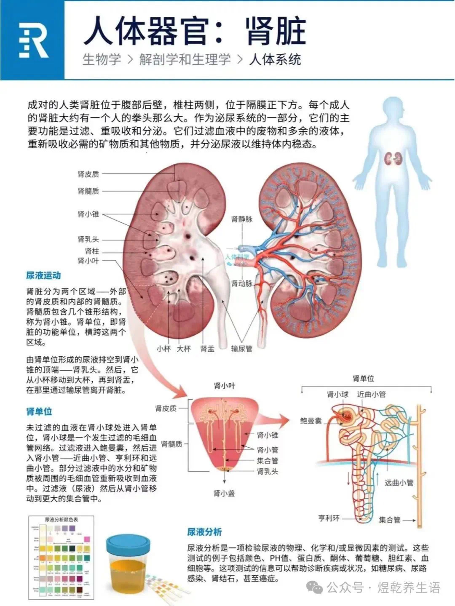

## 肾脏的功能有哪些？

肾脏是人体重要的排泄器官，具有多种功能，主要包括以下几个方面：

1. 排泄废物：肾脏通过过滤血液，将代谢废物（如尿素、肌酐、尿酸等）和多余的水分排出体外，形成尿液。
2. 调节体液平衡：肾脏通过调节尿液的生成和排泄，维持体内水分和电解质的平衡，确保体液环境的稳定。
3. 调节电解质平衡：肾脏能够调节钠、钾、钙、磷等电解质的浓度，维持体内电解质平衡，确保神经、肌肉等组织的正常功能。
4. 调节酸碱平衡：肾脏通过排泄酸性或碱性物质，调节体内的酸碱平衡，维持血液pH值在正常范围内。
5. 分泌激素：
   - 促红细胞生成素（EPO）：肾脏分泌的EPO能够刺激骨髓生成红细胞，维持正常的血液携氧能力。
   - 肾素：肾脏分泌的肾素参与调节血压和体液平衡，通过肾素-血管紧张素-醛固酮系统（RAAS）发挥作用。
   - 活性维生素D：肾脏将维生素D转化为其活性形式（1,25-二羟维生素D3），促进钙的吸收和骨骼健康。
6. 调节血压：肾脏通过调节体液量和分泌肾素等激素，参与血压的调节。
7. 代谢功能：肾脏参与某些物质的代谢，如将氨基酸转化为葡萄糖（糖异生）等。
8. 清除毒素：肾脏能够清除血液中的外源性毒素和药物代谢产物，帮助维持体内环境的清洁。

总之，肾脏在维持体内环境稳定、排泄废物、调节体液和电解质平衡、分泌激素等方面发挥着至关重要的作用。肾脏功能的异常可能导致多种疾病，如肾功能衰竭、高血压、电解质紊乱等。

## 只有一个肾脏会有什么影响？

只有一个肾脏通常不会对健康产生显著影响，因为一个健康的肾脏足以维持身体的正常功能。以下是只有一个肾脏可能产生的影响：

1. 正常生活：大多数人天生有两个肾脏，但有些人可能因为先天原因（如先天性单肾）或后天原因（如手术切除一个肾脏）而只有一个肾脏。只要剩下的肾脏功能正常，通常可以维持正常的生活。
2. 肾功能储备减少：虽然一个健康的肾脏可以满足身体的需求，但肾脏的储备功能会减少。这意味着如果剩下的肾脏出现问题，身体可能更容易受到肾功能不全的影响。
3. 定期监测：只有一个肾脏的人需要定期进行肾功能检查，以确保剩下的肾脏健康。医生可能会建议定期检查血压、尿液和血液中的肌酐水平，以监测肾脏功能。
4. 避免过度负担：为了保护剩下的肾脏，建议避免过度使用某些药物（如非甾体抗炎药）、保持健康的饮食、控制血压和血糖，以及避免过度饮酒和吸烟。
5. 潜在风险：虽然一个健康的肾脏通常足以维持正常生活，但在某些情况下（如严重感染、创伤或慢性疾病），只有一个肾脏的人可能面临更高的风险。因此，保持健康的生活方式非常重要。

总的来说，只要剩下的肾脏功能正常，只有一个肾脏的人通常可以过上健康的生活，但需要更加注意保护肾脏健康。

## 检查

肾动态检查（又称肾动态显像或放射性核素肾图）是一种核医学检查，主要用于评估肾脏的血流灌注、滤过功能、排泄功能以及尿路通畅情况。它通过静脉注射含有放射性同位素（如锝-99m标记的DTPA或MAG3）的示踪剂，利用γ相机连续拍摄示踪剂在肾脏中的代谢过程，生成时间-放射性曲线（肾图），从而分析肾功能。该检查存在误差。安全性较高。