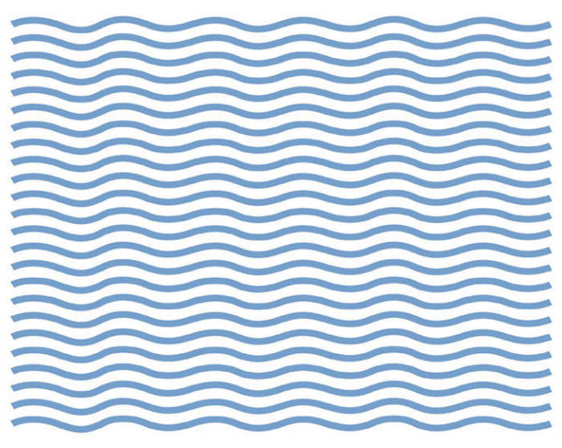

## 一、什么是筋膜？

筋膜（Fascia）是一种覆盖在肌肉、骨骼、血管和神经外层的结缔组织网，就像一张全身的“蜘蛛网”，把我们的身体结构有序地联系在一起。它不仅起到支撑和包裹的作用，还影响着身体的运动协调和力量传导。

附着在肌肉上的筋膜并不是完全平整的，而是略微呈波浪状，就像卷发一样。因为这种结构，筋膜才能够拉伸，并且能够储存能量。

筋膜的波浪状结构越明显，它的弹性和能量储存能力就越大。一般而言，随着年龄增加，波浪状结构会越来越不明显，但通过正确的训练是可以恢复的。

简单来说，筋膜就像衣服的“内衬”，如果这个内衬出现褶皱或粘连，身体就会感到紧绷、酸痛，甚至影响动作表现。

## 二、为什么要进行筋膜放松？

1. 缓解肌肉紧张与酸痛：运动后乳酸堆积、长时间久坐或姿势不良，都会让筋膜变得僵硬，造成酸胀。放松筋膜能帮助缓解不适。
2. 提升关节灵活性：柔软的筋膜能让身体动作更加顺畅，减少受伤风险。
3. 改善血液循环：松弛的筋膜有助于促进血液和淋巴流动，提升代谢效率。
4. 辅助运动表现：很多专业运动员都把筋膜放松当作训练前后的“必修课”，它能帮助肌肉恢复，提升爆发力和协调性。

### 三、常见的筋膜放松工具

### 常用工具：

- 泡沫轴（Foam Roller）：最常见的工具，适合大腿、背部等大肌群。

> 泡沫轴使用注意事项：1.自重施压，15-30s，2cm移动范围，在痛点上着重按压；2.不要滚压肌腱和关节，而是两侧肌肉；3.泡沫轴滚压部位：大腿三个部分，臀部两部分，竖脊肌，中下斜方肌，背阔肌，肱三头肌，胸大肌；4.小臂、肱二头、小腿可大拇指推拿左右互搏，力一定要吃进去。

- 筋膜球（Lacrosse Ball/筋膜球）：直径较小，适合放松臀部深层、小腿和足底筋膜。
- 按摩枪：方便快捷，适合下班或训练后快速放松。
- 瑜伽砖、拉伸带：辅助身体做被动拉伸，延展筋膜。

### 常用手法：

1. 滚压放松：利用泡沫轴或筋膜球，在肌肉上缓慢滚动，每个点位停留 20-40 秒，感受酸胀但可耐受的压力。
2. 点压放松：用球或者按摩枪针对结节点（触感硬块或酸点）进行按压，帮助松解粘连。
3. 拉伸结合：放松后配合动态或静态拉伸，效果更佳。
4. 呼吸与放松：深呼吸能帮助神经系统放松，让筋膜释放更充分。

### 注意事项：

- 放松时要循序渐进，不要用力过猛。
- 避开关节、骨骼等硬组织，专注于肌肉和软组织。

筋膜放松不是奢侈的保养，而是现代人必备的身体管理方式。无论你是健身爱好者、办公室白领，还是只是想让身体更轻松的人，都可以把筋膜放松加入日常习惯。坚持下来，你会发现身体更灵活、精神更轻盈。

## 七、视频教程

@[bilibili](BV1wX4y1m7DD)

