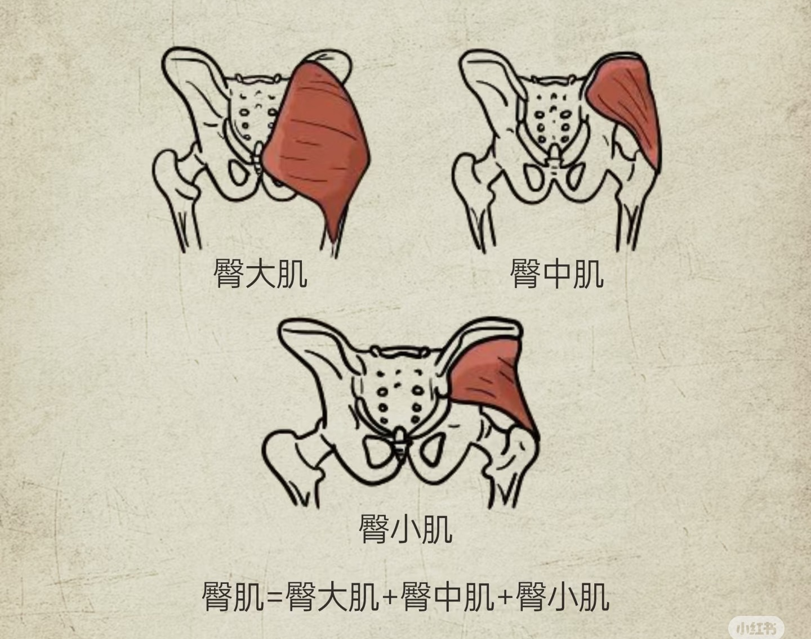
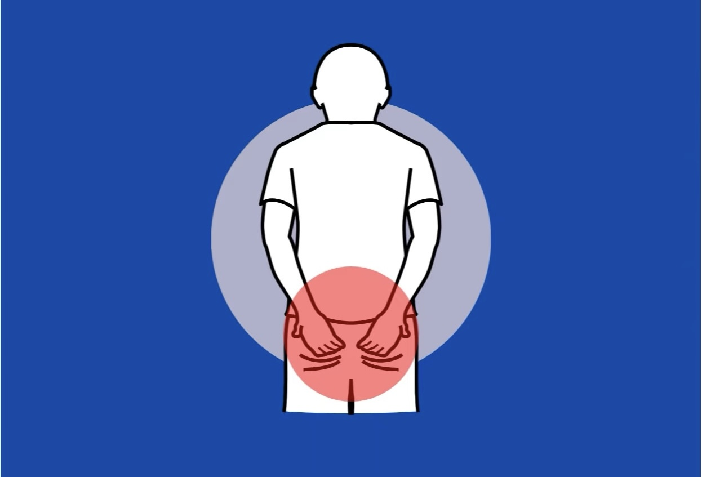
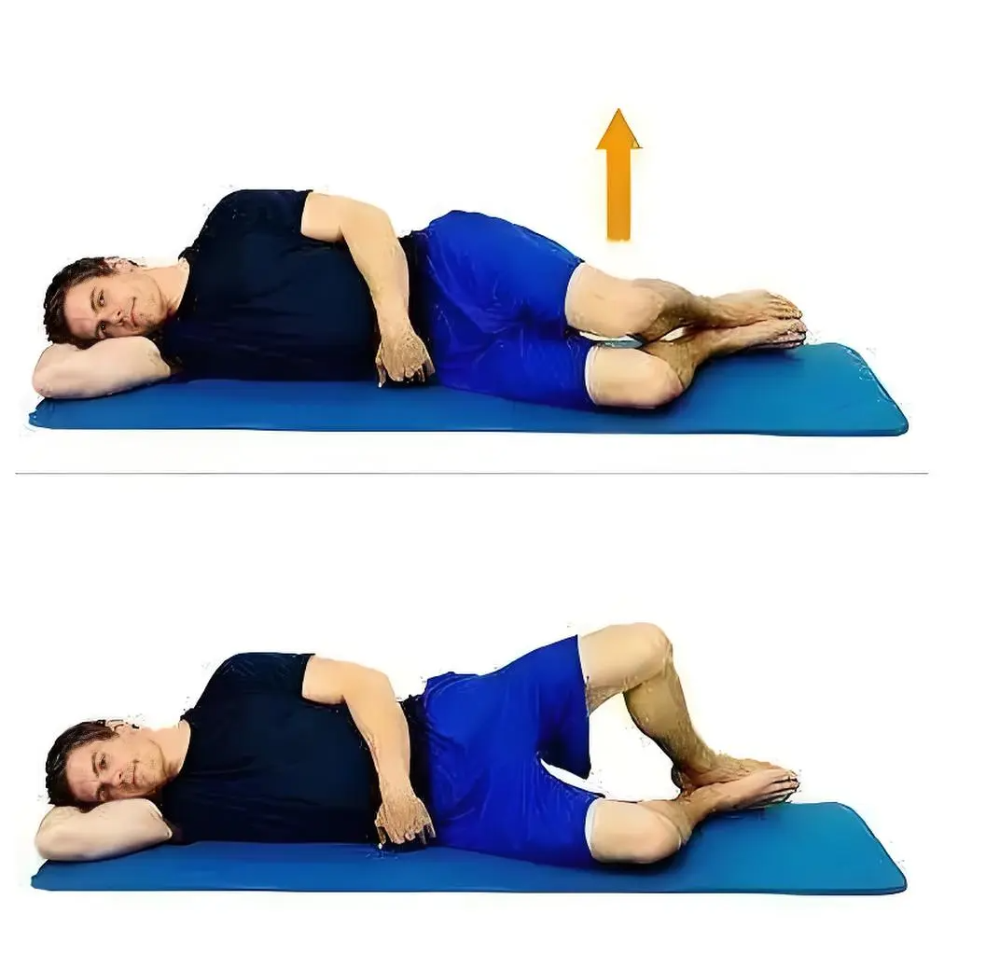
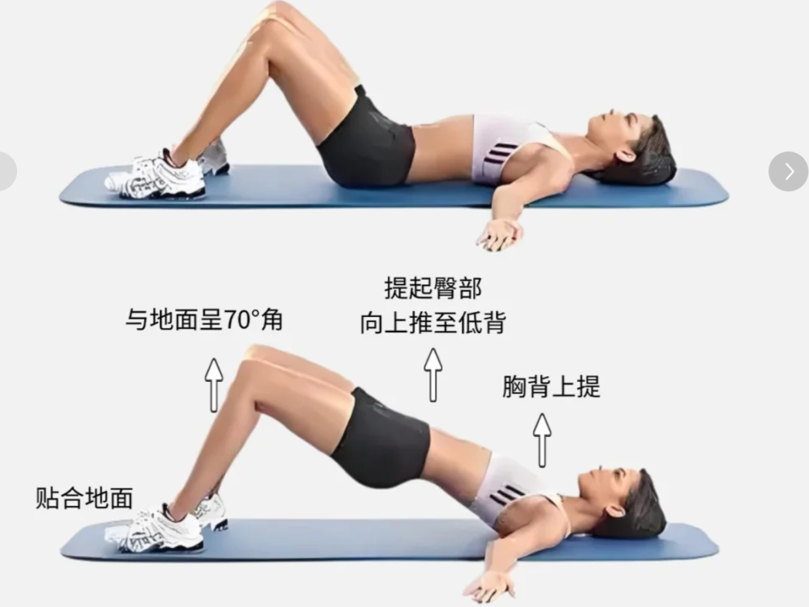
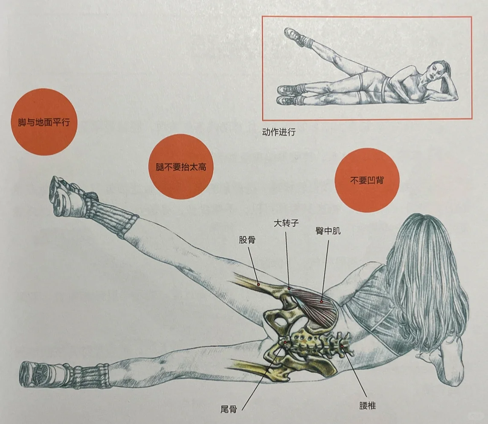
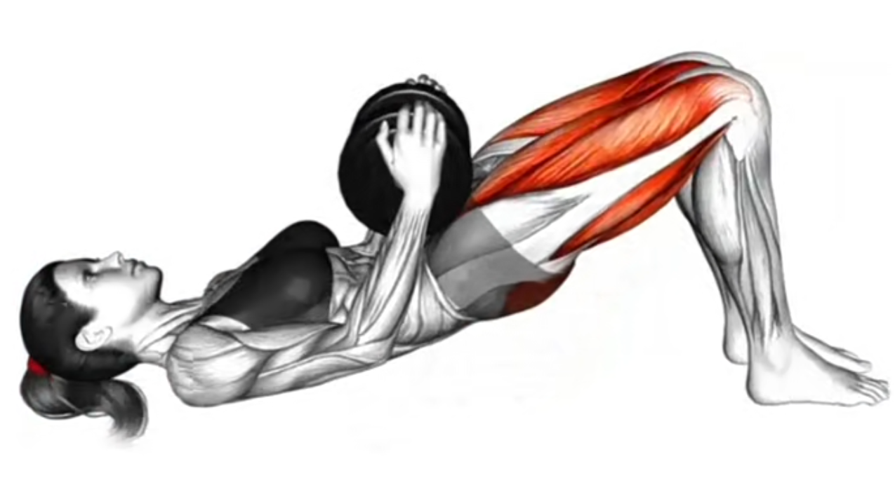
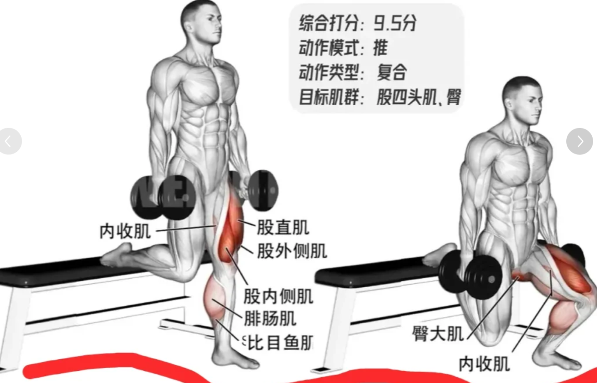
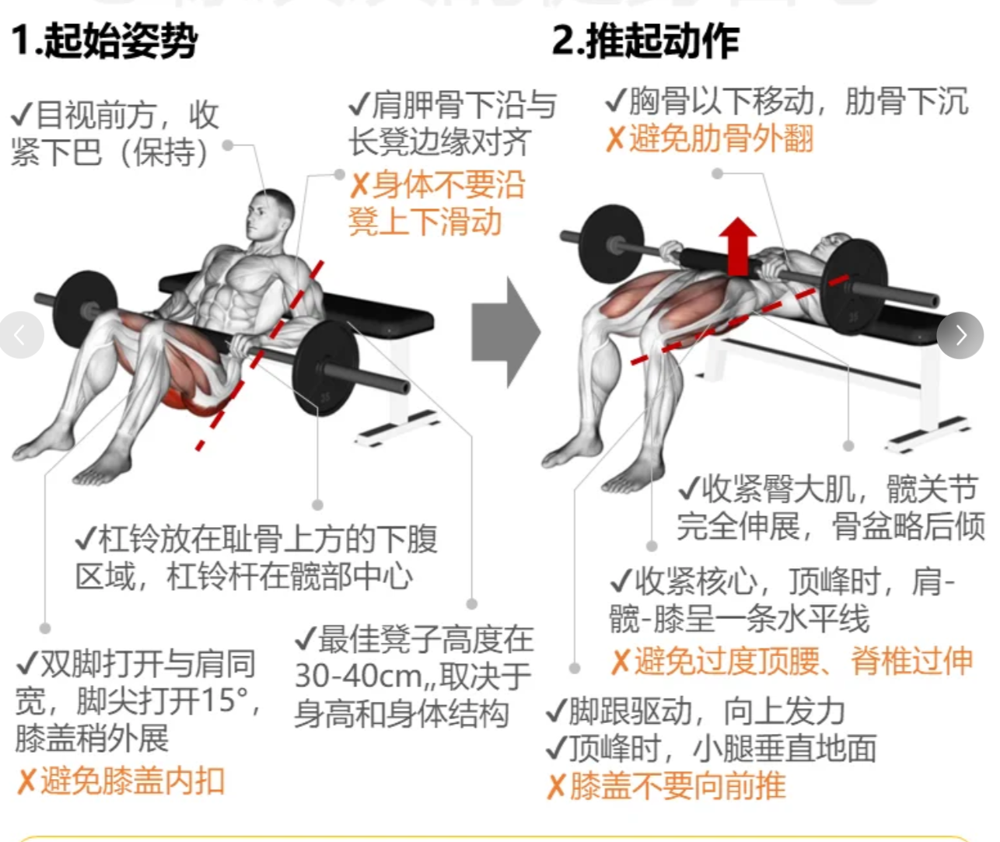

谁杀死我的屁股？—— 你的“死臀”可能正在拖垮身体

先问个扎心的问题：你是不是每天上班坐8小时，下班瘫沙发2小时，走路时总觉得“屁股没发力”，跑两步就膝盖酸、腰背痛？如果中了，那你可能正在被“死臀”盯上。

## 翘臀，亦是“人体发动机”

很多人以为屁股只是“用来坐的肉”，但其实它是人体最强劲的“动力中心”。臀部肌肉由三部分组成：

• 臀大肌：最大块的那块，负责髋关节伸展（比如抬腿往后踢）和外旋（比如把腿往外撇），是跑步、跳跃时的“推进器”；

• 臀中肌：藏在臀大肌深层，像个“隐形腰带”，负责稳定骨盆（比如走路时不让骨盆左右晃），还能控制大腿内旋外旋（比如避免膝盖内扣）；

• 臀小肌：更深层的小肌肉，辅助臀中肌稳定骨盆，默默维持身体平衡。

这三块肌肉协同工作，不仅能让你走得稳、跳得高，还能分担腰部和膝盖的压力。但一旦它们“罢工”，麻烦就来了。

## 死臀，肌肉“睡过头了”

“死臀”学名“臀肌失忆症”（Gluteal Amnesia），不是肌肉坏死，而是肌肉“忘了怎么发力”。

简单说：长期不良习惯让臀部肌肉长期处于松弛、被抑制的状态，久而久之，大脑向臀部肌肉发送的“收缩信号”变弱，肌肉“懒得工作”，逐渐变得无力、僵硬，甚至被脂肪和筋膜粘连“封印”。

怎么判断自己是不是“死臀”？对照看看这几个表现：

1. 久坐后屁股发紧、发麻：站起来时臀部像“生锈”，活动一下才有知觉；
2. 走路/跑步姿势怪：要么左右晃（骨盆不稳定），要么膝盖内扣（臀中肌无力），甚至用小腿“蹭着走”；
3. 练臀没感觉：做臀桥、深蹲时，腰酸腿酸就是屁股没感觉，发力全靠腰和腿“代劳”；
4. 莫名疼痛：久坐后腰痛、膝盖内侧疼、小腿和脚踝酸胀、——因为臀部不发力，压力全转移到了腰椎、膝盖和脚踝。

当然，摸一摸自己的屁股，也可以知道答案：

## 死因，打工人的3个习惯

1. 久坐“杀手”：久坐时，臀部肌肉被持续挤压，血液循环变慢，神经信号传递受阻，就像一直被按在地上摩擦，久而久之“懒得动”；
2. 错误发力“帮凶”：比如走路时总用小腿“带步”，深蹲时膝盖超过脚尖、重心前移，导致臀部肌肉“被边缘化”，长期依赖腰、腿肌肉代偿；
3. 缺乏激活“同伙”：很多人练臀只追求大重量（比如负重臀桥），但没先激活“沉睡”的肌肉，结果越练越借力，臀部反而更“死”。

## 拯救“死臀”，从“唤醒”到“强化”分两步走

想让屁股“复活”，不能上来就猛练，得先“叫醒”它，再“练强”它。

### 1.激活臀肌（每天5分钟，唤醒“沉睡的屁股”）

### 蚌式开合（练臀中肌）

◦ 侧卧，屈膝90度，脚跟并拢；

◦ 保持骨盆稳定，上侧膝盖缓慢向上打开（像蚌壳张开），感受臀部外侧发力；

◦ 15次/侧，做3组。（可加弹力带）

### 臀桥“停顿版”（练臀大肌）

◦ 仰卧，屈膝踩地，双脚与肩同宽；

◦ 慢慢抬髋，直到肩膀、髋、膝盖成一条直线，停顿3秒（重点感受臀部收缩）；

◦ 缓慢下落，12次/组，做3组。

### 侧支撑抬腿（练臀中肌+核心）

◦ 侧卧，单肘撑地，身体成直线；

◦ 上侧腿缓慢抬起（膝盖朝前），感受侧臀发力，10次/侧，做2组。

### 2.强化训练（每周3次，让屁股“重新上班”）

激活后，用这些动作强化肌肉力量：

### 负重臀桥

◦ 基础臀桥姿势，髋部上方放哑铃或杠铃（新手从徒手开始）；

◦ 抬髋时想象“用屁股顶起身体”，20次/组，做4组。

****

### 保加利亚分腿蹲

◦ 一脚踩地，另一脚放在身后的椅子上；

◦ 下蹲时身体前倾，重心放在前腿，感受前侧臀部发力，12次/侧，做3组。

### 臀推（健身房必备）

◦ 背靠史密斯机或稳定的长椅，屈膝踩地；

◦ 用臀部发力将髋部推起，直到身体与地面平行，顶峰停顿2秒，15次/组，做4组。

关键提醒：练完别忘了“放松”

臀部紧张会影响发力，每次训练后用泡沫轴滚动臀大肌和臀中肌（每侧1分钟），松开粘连的筋膜，让肌肉“呼吸”。

## 不想练？生活里的“护臀细节”

• 每坐40分钟起身活动：做5个深蹲或臀桥，让臀部“醒醒盹”；

• 走路时刻意“用屁股发力”：想象每一步都在用臀大肌“往后蹬”；

• 选硬一点的椅子：太软的沙发会让臀部肌肉长期放松，加重“失忆”。

最后想说：屁股不仅是“颜值担当”，更是身体的“动力源泉”。别让久坐和懒癌杀死它——从今天起，每天花10分钟激活、强化。