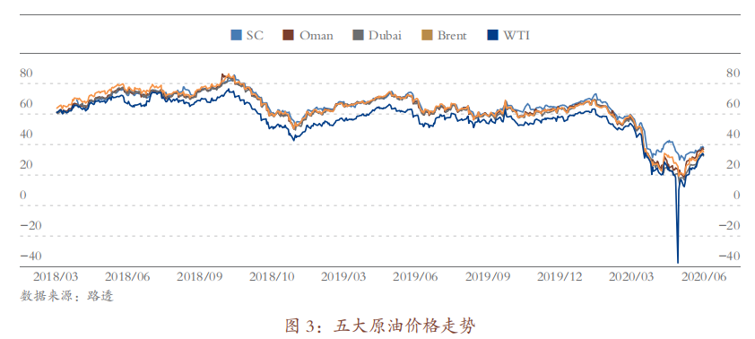
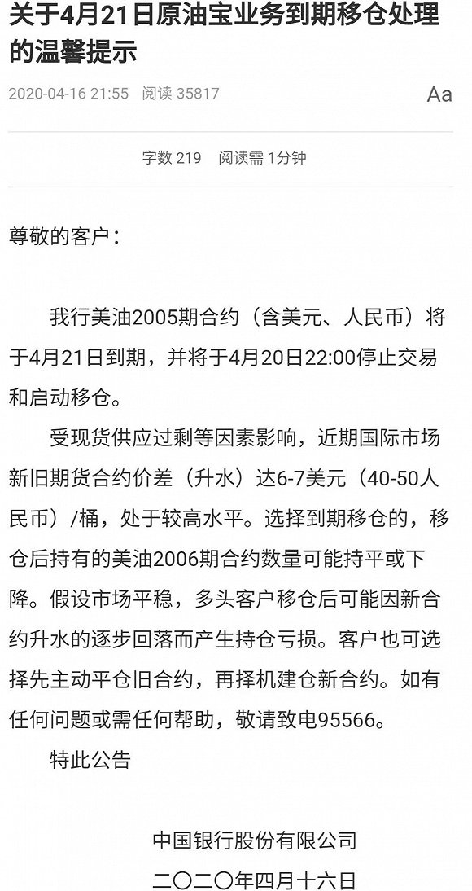
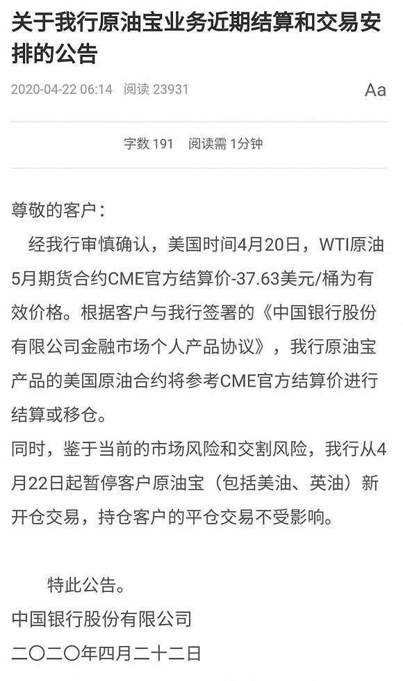

---

title: 原油宝事件
createTime: 2026/02/06 11:07:25
permalink: /invest/qihuo/yuanyoubao/

---

## 原油期货基本介绍

原油期货是目前国际上最大的商品期货品种，其交易、持仓量超过黄金、铜、橡胶等大品种。

其中在纽约交易的WTI 原油期货是交易量最大的石油期货，其主要反映北美地区原油基本面，同时具有引领全球价格的影响力。Brent原油期货在伦敦交易，反映西北欧地区的原油基本面。阿曼原油期货反应的是中东地区的原油基本面。SC中国上海原油期货，反映中国的基本面。除了交易地区不同之外，不同交易所的期货合约的细节不同，主要差异在于交割方式、交易时间、结算价计算方式等。

值得说明的是：即使WTI等期货合约约定了实物交割，但是对于**95%以上**的市场参与者（尤其是个人投资者和投机机构）来说，一般并不会进行实物交割，必须在到期前“反向交易”，平仓离场。但是，期货市场之所以存在，必须有一小部分人真的在进行实物交割，否则期货价格就会变成单纯的数字游戏。这些实物交割的都是真正的产业参与者，例如炼油厂、石油产业链企业等。

## WTI 2005合约的核心要素

让我们进一步聚焦原油宝时间的主角：WTI原油 **“2005合约”** 。指的是 **2020年5月** 交割的合约（即：20年 + 05月）。

**上市日期：**按 NYMEX 规则，WTI 原油期货**提前约 9 年挂牌**，即大约2011 年 5 月前后即可以开始交易。但彼时交易量很低。

成为首行合约：上一份合约（2004合约，即2020年4月合约）于 2020年3月20日（周五）收盘后到期交割。之后，2005合约正式成为距离交割最近的首行合约。

**结算价确认：**结算价确定时段为**美东时间4月20日 14:28-14:30**。对应北京时间为4月21日凌晨。

最后交易日（结束交易）：2020年4月21日，按照结算价平仓或实物交割。**交割地点**：必须在2020年5月在美国俄克拉荷马州的**库欣（Cushing）**交割实物。（交割实物需要储油罐，卡车或管道运输能力）

## “负”油价是怎么产生的

### 核心时间轴

回到2020年初，我们看一下当时原油市场面临的基本面和负油价发生的时间轴。

1. 2020 年初，疫情暴发导致原油需求下降，油价不断下跌，导致美国页岩油的开采成本大于原油收入， 许多开采公司面临破产威胁。 
2. 减产协议破裂。2020 年 3 月，沙特阿拉伯和俄罗斯组织了一场以“稳定原油价格”为主题的会议， 继而引发了一场沙俄石油价格战，原油价格继续大幅度下跌。
3.  国际油价的下跌导致国内多头投资者数量猛增。国内的投资者纷纷抄底原油，多头头寸暴涨。 其中不乏大量非专业的个人投资者（散户），**我记得那时候小红书、B站上，有很多博主“呼吁”做多石油，很多不明所以的散户投入到石油期货中。** 
4. **2020 年 4 月 8 日**：芝加哥商业交易所（CME Group）宣布研究测试负油价交易，提示市场风险。
5. **2020 年 4 月 10 日**：欧佩克 + 达成减产协议，5 月 1 日起每日减产 970 万桶。（**减产协议的达成催生了更大的做多力量）**
6. **2020 年 4 月 15 日**：CME 完成负价格交易清算系统测试，正式支持负价格交易。
7. **2020 年 4 月 20 日**：WTI 原油期货 2005 合约（到期日为 4 月 21 日）结算价跌至 `- 37.63 `美元 / 桶，创历史首个期货负油价。
8. **2020 年 4 月 21 日后**：WTI 原油期货 2006 合约（即6月份交割的合约）报复性反弹，**首行**合约走势形成 “V 型反转”。

### 关键改造：为什么系统要支持负价格交易

2020 年 4 月 8 日 CME Group 宣布研究测试负油价交易，核心是为应对当时**原油市场极端供需失衡引发的交割危机与系统风险**，具体原因可拆解为三点：

1. **供需塌陷与库存爆满的现实压力**：疫情导致全球原油需求从日均 1 亿桶骤降至 7000 万桶，美国库欣地区（WTI 期货交割地）库存快速攀升 —— 截至 4 月 17 日库存达 6000 万桶，占其 7600 万桶总库容的 76%，且仍在以日均数百万桶速度填满。若期货到期时多头无法找到仓储接收实物，可能被迫 “贴钱甩卖” 合约，负价格成为现实风险，CME 需提前做好系统准备。

2. **交易机制适配的技术必要性**：传统原油期权定价模型（如 Black-Scholes 模型）默认价格大于 0，无法应对负价格场景。当时市场已出现个别地区重油现货负报价（如美国 Permian 地区井口价），若 WTI 期货价格跌入负值，现有交易、清算系统将瘫痪。负价格符合市场规律，原油的储存也是需要成本的，确保订单提交、结算、保证金计算等流程正常运行。

3. **市场恐慌与持仓风险的提前警示**：当时大量散户通过纸原油、ETF 盲目抄底 WTI 05 合约，机构为对冲风险也积累了大量多头头寸，但多数参与者无实物交割能力。CME 通过测试公告释放 “负价格可能发生” 的信号，本质是提示市场：若临近交割无法平仓，需承担 “倒贴钱交油” 的损失，避免恐慌性平仓引发更大市场混乱。

   

### 负油价产生的本质原因

我们首先要明确，产生负价格的不是所有石油期货，更不是石油现货，而是特定的一笔石油期货——WTI 2005合约。正如我们上文介绍，它是指2020年5月交割的石油期货合约。而且4月21日之后，WTI 2006合约成为**首行**合约后，价格迅速拉回到正常价格区间。下面两个图分别展示了五大原油期货价格走势，以及WTI 2005和2006价格走势：

通过对比分析，我们归纳总结WTI 2005 负油价的原因主要为临期交割带来的流动性丧失。具体分析如下：

国内散户参与原油投资有四种渠道 —— 涉油公司股票、基金（如南方原油 FOF 基金、华宝油气 FOF 基金）、银行纸原油产品、原油期货（内盘上海原油期货或外盘原油期货）；负油价前 WTI 原油期货价格最低，吸引大量国内散户做多纸原油产品，印度、韩国及欧美也有类似情况，散户通过 ETF 基金向原油期货市场输出头寸。

纸原油、ETF 基金发行机构为对冲空头风险敞口，需买入 WTI 原油期货对冲，成为多头头寸重要来源，但机构通常不进行实物交割（产品条款无交割义务、交割增加成本、临近到期日准备不足、库存暴涨无罐容）；4 月供大于求严重，叠加 4 月 10 日减产协议达成，散户抄底情绪高涨，WTI 原油期货 05 合约持仓加重；CME Group 仅通过测试负价格公告提示风险，散户难以理解，机构因风险不由自身承担而麻木。散户通过纸原油或ETF基金盲目“抄底”，导致产品发行机构需要在期货市场持有大量多头头寸。

临近交割日，由于机构无法进行实物交割且库容不足，必须平仓，这导致了流动性丧失。

**截至北京时间4月20日晚11点，WTI的2005合约的单边持仓过15000手**。伴随着库欣地区原油储存压力趋紧，实际上已出现严重的流动性风险。多头只能止损出局。随后在北京时间4月21日凌晨2点开始，WTI5月原油期货价格一度暴跌至-40.32美元，并最终以-37.63美元结算。

## 原油宝

### 产品基本介绍

2018 年 1 月，中国银行推出了“原油宝”产品，为国内个人客户提供与境外原油期货挂钩的一项交易服务。该产品面向个人客户发行，挂钩境内外原油期货合约。由于对于国内的投资者，直接投资原油期货风险和资金需求量均很高，而中行推出的“原油宝”产品，为投资者们提供了另一种投资机会，大大降低了原油期货投资的风险和门槛。 “原油宝”和 WTI 原油期货挂钩，涨跌同步。在整个交易过程中，中行一方面作为国内多空方的交易对手进行大量交易，并将头寸轧差；另一方面，作为国际原油期货的参与者，将在国内“原油宝”市场上产生的净头寸风险转移。

- **挂钩标的**：分为美国原油（挂钩芝加哥商品交易所 CME 的 WTI 原油期货首行合约）、英国原油（挂钩洲际交易所 ICE 的布伦特原油期货合约）两类。

- **交易单位**：交易起点为 1 桶，最小递增单位为 0.1 桶（降低个人参与门槛）；其挂钩的底层期货合约（如 WTI）单位为 1000 桶 / 手，但原油宝层面拆分为小额交易单位。

- **保证金要求**：采用**100% 全额保证金**制度，无杠杆；同时**设置保证金强平线20%**，当投资者账户内的 “保证金充足率”（即账户剩余资金 / 持仓合约价值）跌至 20%（含）以下时，中行应启动**强制平仓操作**，避免投资者损失进一步扩大。

- **常规交易时间**（非最后交易日）：分为两个时段

1. 北京时间 22:00 - 次日凌晨 2:30（与 CME WTI 原油期货主力交易时段基本同步）；
2. 次日上午 9:00 - 下午 15:30（补充境内投资者日间交易需求）。

**最后交易日**：**合约到期当月的 20 日**，交易截止时间为**北京时间 22:00**，之后进入到期处理流程。

**合约到期处理规则**

原油宝合约到期时，提供两种处理方式，投资者未主动选择则默认**自动移仓**：

1. **自动移仓**：银行在最后交易日收盘后，自动平仓投资者持有的当期合约，并以当日结算价开仓下期合约（移仓成本由投资者承担，2020 年事件中因临近交割流动性枯竭，移仓无法有效执行）。
2. **到期轧差**：仅平仓当期合约，不开仓下期合约，按结算价计算盈亏后结清头寸。

###  穿仓经过

北京时间4月20日晚上22点，原油宝（挂钩WTI 2005）停止交易。根据原油宝的产品设计，每当新旧合约交替的交易日，都会提前停止与客户交易。我有充分的理由认为，这个设计是银行为了给后台留出处理时间。在22:00冻结客户账户后，银行需要统计全行所有客户的“多空净头寸”（Net Position）。**22:00 - 02:30 之间：** 银行拿着统计好的净头寸，去国际期货市场进行平仓或移仓操作。这中间的4个半小时，理论上是银行代表客户去完成“把手里的单子卖掉（平仓）”或“换到下个月（移仓）”的过程。原油宝设计的默认方式是“移仓”。

原油宝停止交易后，其挂钩的WTI 2005期货仍在进行最后的多空拼杀。北京时间4月21日凌晨，油价接连经历了第二轮和第三轮下跌，此时的国际原油期货市场上的多头想要平仓撤出，但已无人接盘，于 2:08 分跌破 0 $大关，于 2:29 分跌到历史最低点−40.32 $/桶，最终在 2:30 分以−37.63 $/桶的结算价格成交。

### 事后收尾

中国银行一开始发布公告，“负油价”有效，并且需要客户自担损益（因为选择做多的客户多，中国银行I实打实地持有WTI大量头寸）。做空的客户赚的盆满钵满，但是做空的是少数。做多的客户以负油价结算，倒欠中国银行一笔巨款。中行要求客户限期偿还。

客户无法接受有两点：（1）银行的产品设计不合理，晚上10点之后我看到油价下跌还想继续交易，但是我只能眼睁睁看着。（2）产品设计了强平线，理论上的20%的保证金不见了，还倒欠银行巨款。

其中第二个原因似乎有充足的理由，因此经过法院判决（2020 年 12 月一审，2021 年 2 月二审维持原判）**中行**承担投资者**全部穿仓损失**（即投资者倒欠银行的资金），赔偿投资者**20% 的本金损失**，同时返还已扣划的投资者账户保证金余额，并支付相应资金占用费，**投资者**自行承担**80% 的本金损失**，法院认定投资者需对原油市场风险具备基本认知，且中行已履行基础风险提示义务。

这个判决显然是公平的，又一定程度上照顾了客户。因为熟悉保证金交易的客户应当知道，当面临单边极端行情，保证金比例可能会因为“滑点“而失效。

## 反思与思考

自2013年工行首次推出账户原油后，包括中行、建行、民生等在内的多家银行跟进布局。与中行不同，工行、建行、民生等银行都在一周前为客户完成移仓。具体而言，建设银行的纸原油业务，在4元14日至4月15日已基本完成移仓换月工作，当时平仓价格在21至20美元/桶之间。

那工行、建行的产品一定好吗？答案是否定的。

这个交易是代客交易，跟踪底层资产是核心设计理念。中行的产品显然提供给客户更真实的选择——尽可能提供更长的期货交易时间，把移仓换位的权力交给客户自己。客户作为期货交易的玩家，理应知道期货临近交割时面对的流动性风险，而风险往往意味着收益/损失，客户有权参与做空或者做多。我相信有相当一部分客户，是想要搏一搏最后的交割日是否会暴涨，以赚取超额利润。

但是显然产品又有缺陷，中行为了自身结算的需要，不得不给自己预留一段时间，将交易时间提前至北京时间22点结束，给自己预留4个小时的时间计算头寸，形成了4个小时的交易黑洞。但是哪怕技术进步，4个小时的时间可以压缩到4分钟，也无法避免这个悲剧：银行作为做市商、二道贩子，总需要一个时间去整理自己的筹码，在这段时间内总会让客户失去交易的权力。

### 

