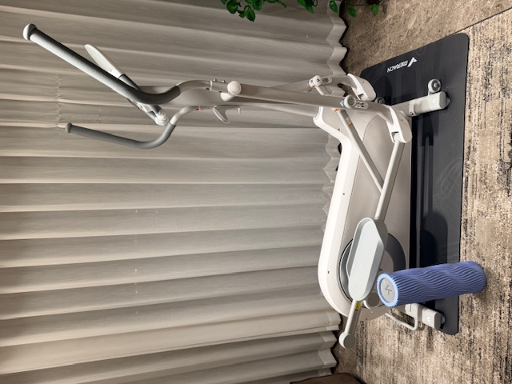

## 记录家用椭圆仪的选购过程

在AI的帮助下，能够很宽泛的获知椭圆仪选购应该关注的参数。比较核心的指标是步距（越长越舒服），自发电比插电要贵几百块钱。带坡度调节可以刺激不同的肌肉群，也要贵几百块钱。家用还需要考虑占地面积。

从京东选了两个品牌的几个型号列举如下（2026年3月）

## 迈瑞克

备注：仅包含**自发电款**，型号不全，仅有经典型号。

|            |    K60     |    K55     | 凌波L7Pro  | 凌波L3 |  T100  |
| :--------: | :--------: | :--------: | :--------: | :----: | :----: |
|   京东价   |   4619元   |   2919元   |   2619元   | 1919元 | 1394元 |
| 占地（cm） | 171.5*66.5 | **120*65** | 148.8*56.6 | 101*58 | 104*56 |
| 步距（cm） |     50     |     50     |   42-50    |   42   |   33   |
| 飞轮（kg） |     12     |     11     |     10     |   9    |   6    |
|    坡度    |   0-12°    |     /      |   6-12°    |   /    |   /    |
| 间距（cm） |    48.5    |    48.5    |     /      |   /    |   /    |
|    发电    |   自发电   |   自发电   |   自发电   | 自发电 | 自发电 |
|  前/后驱   |  **前驱**  |  **前驱**  |    后驱    |  后驱  |  后驱  |

## 迪卡侬

|            |   EL100   | EL520  | EL540  |
| :--------: | :-------: | :----: | :----: |
|   京东价   |  1249元   | 1999元 | 2449元 |
| 占地（cm） | **90*54** | 146*63 | 146*63 |
| 步距（cm） |    33     |   39   |   39   |
| 飞轮（kg） |    1.5    |   9    |   9    |
|    坡度    |     /     |   /    |   /    |
| 间距（cm） |     /     |   /    |   /    |
|    发电    |   电池    | 自发电 | 自发电 |
|  前/后驱   |   后驱    |  后驱  |  后驱  |

## MOKFITNESS  摩刻

|            | O2 RPO | O2时尚 | O2经典 | Luna Pro   | Luna       |
| :--------: | :----: | :----: | :----: | ---------- | ---------- |
|   京东价   | 2119元 | 1819元 | 1894元 | 3619元     | 3419元     |
| 占地（cm） | 145*72 | 140*62 | 108*52 | 172.5*61.5 | 172.5*61.5 |
| 步距（cm） | 45可调 |   39   |   45   | 52         | 52         |
| 飞轮（kg） |   8    |   8    |   8    | 13         | 13         |
|    坡度    |   /    |   /    |   /    | 12°        | /          |
| 间距（cm） |   /    |   /    |   /    | /          | /          |
|    发电    | 自发电 | 自发电 | 自发电 | 自发电     | 自发电     |
|  前/后驱   |  后驱  |  后驱  |  后驱  | **前驱**   | **前驱**   |

## 樊品

|            | 大木马 |   小木马    |
| :--------: | :----: | :---------: |
|   京东价   | 3619元 | 1900-2500元 |
| 占地（cm） | 110*45 |  94.2*49.2  |
| 步距（cm） |   35   |     30      |
| 飞轮（kg） |   10   |      5      |
|    坡度    |   /    |      /      |
| 间距（cm） |  13.5  |      /      |
|    发电    | 自发电 |   自发电    |
|  前/后驱   |  后驱  |    后驱     |

## 最终选择了迈瑞克凌波L7 PRO

主要原因是家用，兼顾空间、家庭成员，以及带坡度调节的需求。

待使用一段时间后再更新体验

